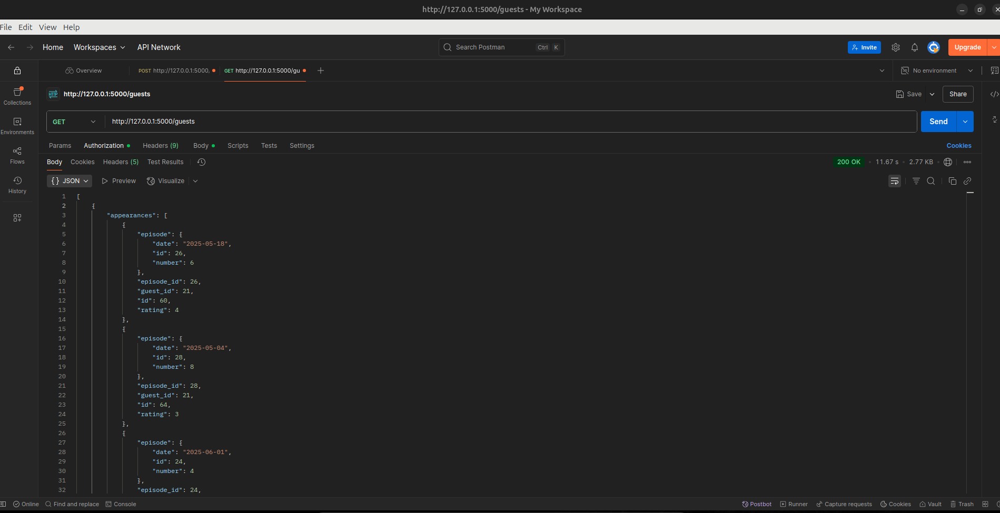
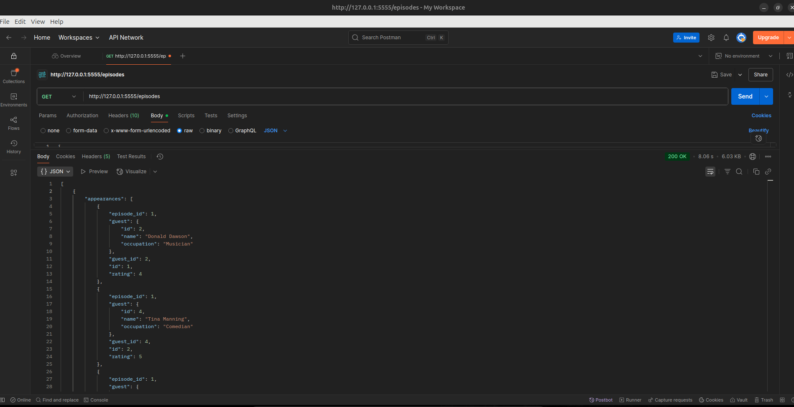
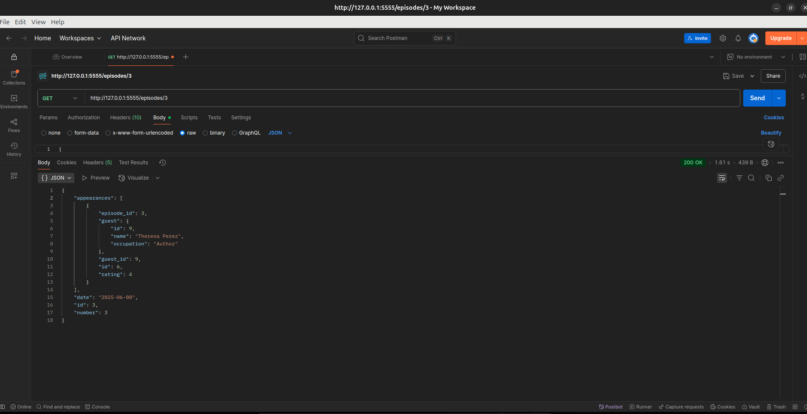
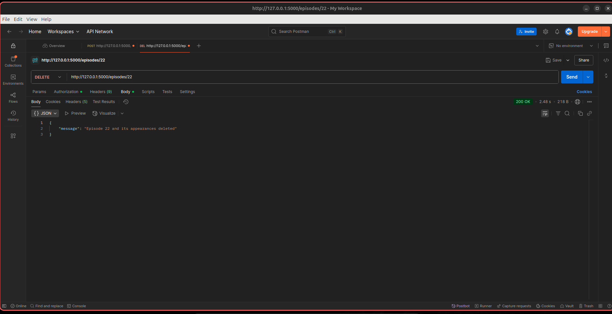
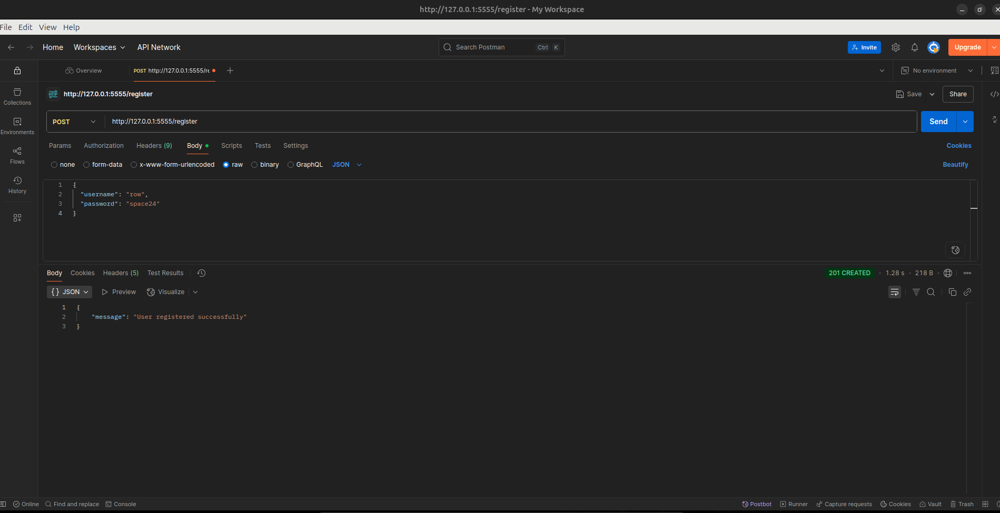
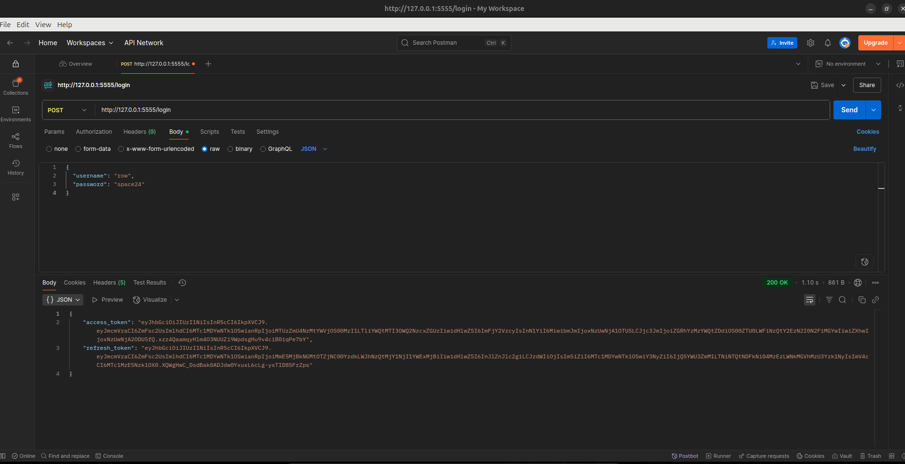
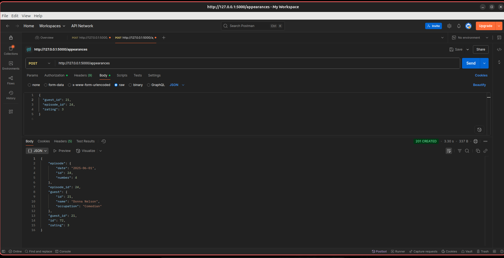
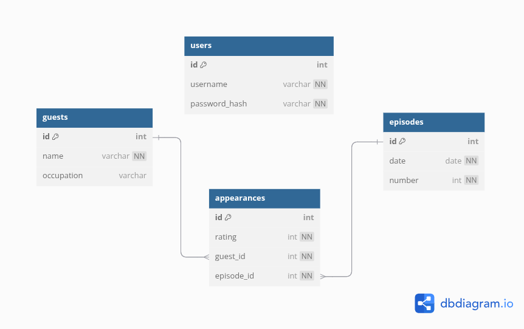

# **Late Show API**


> A secure, **RESTFUL Flask API** for managing late night show guests, episodes, and appearances. Features include User registration/login JWT authentication, and relational endpoints.

---

## **Requirements**

- Flask backend API with postgreSQL
- JWT-based authentication (access + refresh tokens)
- Models: `User`, `Guest`, `Episode`, `Appearance`
- Secure endpoints with decorators
- Token blacklisting and expiration handling

## **Setup**

### **Pre-Requisites**

- Operating System: **(Windows 10+, Linux 3.8+, or MacOS X 10.7+)**
- Python version: 3.12+
- PostgreSQL (ensure a database is created)
- Pipenv
- Postman account (optional but recommended): [Download](https://www.postman.com/)
- RAM: **2GB minimum**, **4GB recommended** (for smoother development)
- Free Disk Space: **1GB minimum**, **2GB recommended**

---

## **Installation**

1. Clone this repository:
   ```bash
   git clone https://github.com/Richard3wasonga/late-show-api-challenge 
   ```

2. Navigate to the project directory:
   ```bash
   cd late-show-api
   ```

3. Install dependencies:
   ```bash
   pipenv install
   ```

4. Activate python environment:
   ```bash
   pipenv shell
   ```

5. Run Migrations and Seed Data
> - Run `flask db init` **only once**,  and only if the `migrations/` folder does not already exist.
   ```bash
   flask db init
   flask db migrate -m "Initial"
   flask db upgrade
   python server/seed.py

   ```

6. Start the server

   **Option 1 - Run directly with python:**
   ```bash
   python server/app.py
   ```

   **Option 2 - use `flask run`(recommended for development):**
   **Linux/macOS**
   ```bash
   export FLASK_APP=server/app.py
   export FLASK_ENV=development
   flask run
   ```
   **Windows CMD**
   ```bash
   set FLASK_APP=server/app.py
   set FLASK_ENV=development
   flask run
   ```
   **Windows PowerShell**
   ```bash
   $env:FLASK_APP = "server/app.py"
   $env:FLASK_ENV = "development"
   flask run
   ```
   The app will now be running at:
   ```bash
   http://127.0.0.1:5555
   ```

---

## **Project Structure**

```markdown

.
├── challenge-4-lateshow.postman_collection.json
├── migrations
│   ├── alembic.ini
│   ├── env.py
│   ├── README
│   ├── script.py.mako
│   └── versions
│       └── 4f40fe77337d_initial_migration.py
├── Pipfile
├── Pipfile.lock
├── README.md
├── screenshot
│   ├── allepi.png
│   ├── appearances.png
│   ├── deletepisode.png
│   ├── idepi.png
│   ├── login.png
│   └── register.png
└── server
    ├── app.py
    ├── config.py
    ├── controllers
    │   ├── appearance_controller.py
    │   ├── auth_controller.py
    │   ├── episode_controller.py
    │   ├── guest_controller.py
    │   └── __init__.py
    ├── models
    │   ├── appearance.py
    │   ├── episode.py
    │   ├── guest.py
    │   ├── __init__.py
    │   ├── token_blocklist.py
    │   └── user.py
    └── seed.py

```

---
## **PostgreSQL DB setup**

Create your own database in Postgres:

```bash

CREATE DATABASE late_show_db;

```

## **Create a `.env` File**
In the root of your project, create a .env file and add the following:

```bash

DATABASE_URI=postgresql://<your_username>:<your_password>@localhost:5432/late_show_db
JWT_SECRET_KEY=<your_super_secret_jwt_key>

```
## **Replace Placeholders:**

| Key              | Description                                                                 |
|------------------|-----------------------------------------------------------------------------|
| `DATABASE_URI`   | Your PostgreSQL connection string. Make sure the database already exists.   |
| `JWT_SECRET_KEY` | A long, random string used to secure JWT tokens. Generate securely.         |


## **Do Not Share `.env``**

Make sure `.env` is included in your `.gitignore` file:

```bash

# .gitignore
.env

```
This keeps your credentials safe and secure.

## **API Routes Summary**


| Method | Endpoint           | Auth Required  | Description                        |
|--------|--------------------|----------------|------------------------------------|
| GET    | `/guests`          | No             | Get all guests                     |
| GET    | `/episodes`        | No             | Get all episodes                   |
| GET    | `/episodes<int:id>`| No             | Create a new episode               |
| DELETE | `/episodes<int:id>`| Yes            | Delete a episode                   |
| POST   | `/appearances`     | Yes            | Link a guest to an episode         |
| POST   | `/register`        | No             | Register a new user                |
| POST   | `/login`           | No             | Login and receive access tokens    |
| POST   | `/refresh`         | Yes            | Refresh your access token          |


## **ROUTES Deliverables**

### **GET/`guests`**

Retrieve a list of guests:

```json

[
  {
    "id": 4,
    "name": "Dustin Long",
    "occupation": "YouTuber"
  }
]

```



### **GET/`episodes`**

Return all episodes:

```json

[
  {
    "id": 1,
    "date": "2024-06-01",
    "number": 1
  }
]

```



### **GET/`episodes<int:id>`**

Retrive a specific episode by a specific id:

```json

{
  "id": 1,
  "date": "2024-06-01",
  "number": 1,
  "appearances": [
    {
      "id": 1,
      "guest": { "id": 2, "name": "John Doe" },
      "rating": 5
    }
  ]
}

```


### **DELETE/`episodes<int:id>`**

Delete a specific episode:

```json

{
    "message": "Episode 21 and its appearances deleted"
}

```



### **POST/`register`**

Registers a new user:

```json

{
  "username": "janedoe",
  "password": "securepassword123"
}

```

Response:

```json

{
  "message": "User registered successfully"
}

```



### **POST/`login`**

Login to get a JWT access and refresh token:

Request:

```json

{
  "username": "janedoe",
  "password": "securepassword123"
}

```

Response:

```json

{
  "access_token": "<JWT_ACCESS_TOKEN>",
  "refresh_token": "<JWT_REFRESH_TOKEN>"
}

```
Use the `access_token` in protected routes like this:

```http

Authorization: Bearer <JWT_ACCESS_TOKEN>

```


### **POST/`appearances`**

Headers:

```bash

Authorization: Bearer <JWT_ACCESS_TOKEN>
Content-Type: application/json

```

Request:

```json

{
  "guest_id": 2,
  "episode_id": 5,
  "rating": 4
}

```

Successful Response:

```json

{
  "id": 10,
  "rating": 4,
  "guest_id": 2,
  "episode_id": 5
}

```
Error(missing/invalid token):

```json

{
  "error": "Missing token"
}

```
Error(validation):

```json

{
  "error": "Rating must be between 1 and 5."
}

```



## **Model & Relationship**

- A `User` can register and authenticate with a password and username.
- A `Guest` can appear in many `Episodes` (via `Appearance`).
- An `Episode` can feature many `Guests` (via `Appearance`).
- An `Appearance` is a join table connecting `Guest` and `Episode`, and it also stores a `rating` (1–5).



## **Tech Stack**

|Tool / Library          | Description                                              |
|------------------------|----------------------------------------------------------|
| **Python 3.12**        | Core programming language                                |
| **Flask**              | Web framework for building the REST API                  |
| **Flask-RESTful**      | Adds resource routing and response handling to Flask     |
| **Flask-JWT-Extended** | Provides JWT authentication support                      |
| **Flask-Migrate**      | Handles database migrations using Alembic                |
| **SQLAlchemy**         | ORM (Object Relational Mapper) for database interaction  |
| **PostgreSQL**         | Relational database used for development and production  |
| **Faker**              | Used for generating realistic fake seed data             |
| **Postman**            | API client for testing routes and authentication         |
| **Pipenv**             | Virtual environment and dependency manager               |

---
## **Authors**
- Richard Wasonga - [GitHub Profile](https://github.com/Richard3wasonga)

## **Contributors**
- Bob Oyier - [GitHub Profile](https://github.com/oyieroyier)

- Titus Ouko - [GitHub Profile](https://github.com/costamay)


## **License**

This project is open-source and available under the MIT License.


